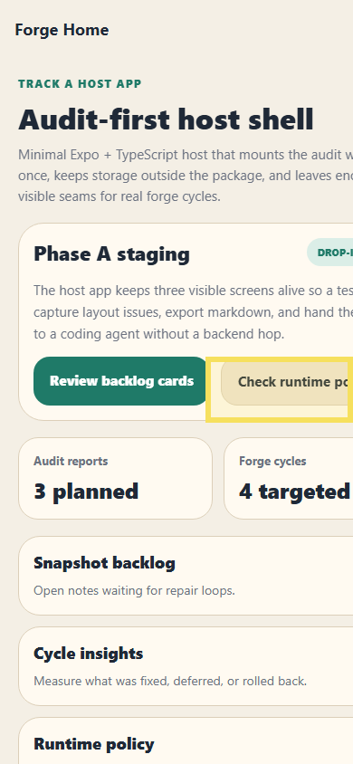

# Bug Raporu — Audit Forge Host

**Tarih:** 14.05.2026 10:56  
**Toplam:** 1 not · 🔴 1 açık

---

## Ekran: /

### 🔴 #1 — İkincil aksiyon butonu dar viewport'ta ekran dışına taşıyor

- **Durum:** Açık
- **Zaman:** 14.05.2026 10:56
- **Raporlayan:** bahri-test

Host shell ana kartındaki aksiyon satırı iki sabit genişlikli buton kullanıyor. 390px genişlikte ikinci buton sağdan kırpılıyor; tester metni tam okuyamıyor ve CTA alanı güven vermiyor.

---
