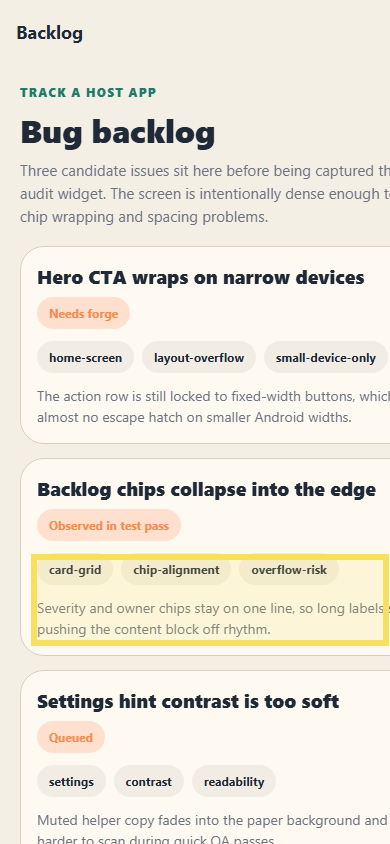

# Bug Raporu — Audit Forge Host

**Tarih:** 14.05.2026 10:57  
**Toplam:** 1 not · 🔴 1 açık

---

## Ekran: /backlog

### 🔴 #1 — Backlog kartındaki chip ve açıklama satırı tek hatta zorlanınca blok ritmi bozuluyor

- **Durum:** Açık
- **Zaman:** 14.05.2026 10:57
- **Raporlayan:** bahri-test

İkinci backlog kartında etiket satırı ve açıklama bloğu dar ekranda sağ kenara yaslanıyor. Özellikle uzun label'larda kart içindeki nefes payı kayboluyor; satır wrap stratejisi yok gibi davranıyor.

---
