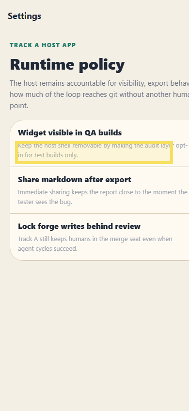

# Bug Raporu — Audit Forge Host

**Tarih:** 14.05.2026 10:58  
**Toplam:** 1 not · 🔴 1 açık

---

## Ekran: /settings

### 🔴 #1 — Yardımcı açıklama metni arka plana fazla karışıyor

- **Durum:** Açık
- **Zaman:** 14.05.2026 10:58
- **Raporlayan:** bahri-test

İlk ayar satırındaki hint metni açık bej zemin üzerinde çok soluk kalıyor. Hızlı QA turunda okunabilirlik düşüyor; satır yüksekliği ve kontrast birlikte ele alınmalı.

---
