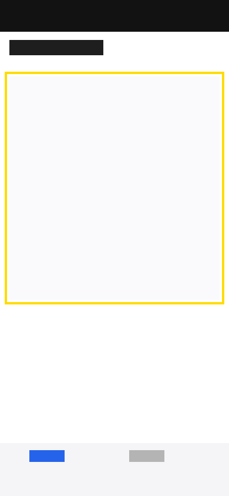

# 🐛 Audit Raporu — nokta-audit-forge

**Uygulama:** nokta-audit-forge  
**Ekran:** IdeasScreen  
**Tarih:** 2026-05-19  
**Raporlayan:** karahan-qa  
**Widget:** @xtatistix/mobile-audit v0.1.0

---

## 📱 IdeasScreen

### 🔴 Açık — Not #2

**Not:** Fikir listesi boş olduğunda ekran tamamen boş kalıyor. Hiçbir yönlendirme mesajı, ikon ya da aksiyon yok. Kullanıcı uygulamanın bozuk olduğunu sanıyor.

**Alan:** FlatList — boş durum alanı (ekranın orta kısmı)



> *Sarı kutu: ListEmptyComponent olması gereken bölgeyi işaret ediyor — içerik tamamen yok.*

**Bağlam:**
- Platform: Android (Pixel 6 emulator)
- Expo SDK: ~53.0.0
- Adım: Tüm fikirler kaldırıldı → liste boş → ekran boş

**Beklenen:** "Henüz fikir yok. İlk fikrini ekle!" tarzında bir boş durum mesajı ve aksiyon butonu  
**Gerçekleşen:** Beyaz ekran — `FlatList` hiçbir şey render etmiyor

**Kod bağlamı:**
```tsx
// ideas.tsx — ListEmptyComponent prop'u hiç verilmemiş
<FlatList
  data={ideas}
  renderItem={({ item }) => <IdeaCard idea={item} />}
  contentContainerStyle={styles.list}
  // ListEmptyComponent eksik ← BUG-002
/>
```

---

## Özet

| Metrik | Değer |
|---|---|
| Toplam not | 1 |
| 🔴 Açık | 1 |
| ✅ Düzeltildi | 0 |
| Ekran | IdeasScreen |

---

*Üretildi: nokta-audit-forge / karahan-qa / 2026-05-19 09:22*
