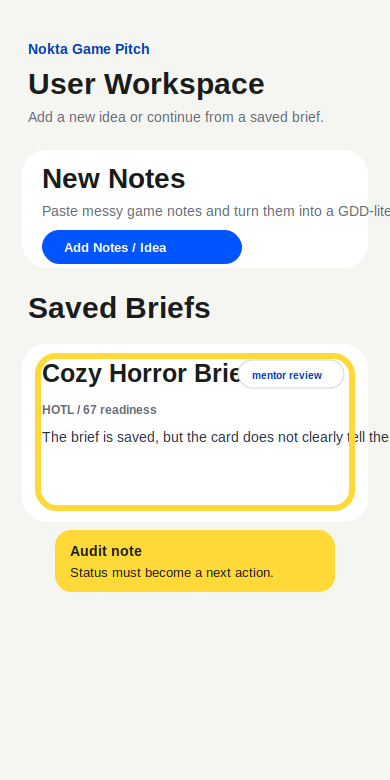

# Audit Report 01 - User Workspace Status

**Screen:** `user`  
**Reporter:** customer-developer  
**Type:** feature repair input  
**Widget state:** burn-in highlight over saved brief card

## Customer Note

The saved brief card says `mentor review`, but that reads like a raw database
status. As a user I need to know what to do next: wait for mentor, open future
plan, or continue without review.

## Forge Input

- READ: inspect `renderSavedBriefCard`.
- LOCATE: status pill and action button in the saved brief list.
- HYPOTHESIZE: if the card translates status into a next action, users can
  drive the review loop without asking the developer what the state means.
- REPAIR: add customer-facing labels and action hints for saved, waiting review,
  and reviewed briefs.
- TEST: `npm run typecheck` plus manual user workspace flow.
- VERIFY: saved cards expose status, next action, and correct open button text.
