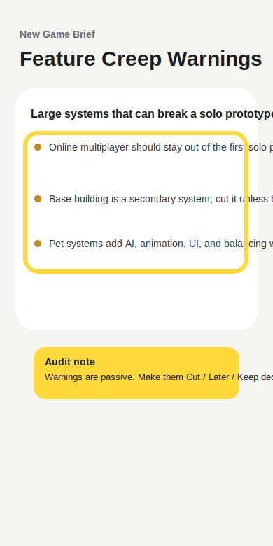

# Audit Report 02 - Feature Creep Actions

**Screen:** `newBrief.result`  
**Reporter:** customer-developer  
**Type:** feature repair input  
**Widget state:** burn-in highlight over feature creep warnings

## Customer Note

The feature creep list is useful, but it is still passive. I want the app to
turn each warning into a development decision, such as `Cut for v1`, `Move
later`, or `Keep only if core`.

## Forge Input

- READ: inspect result rendering and feature creep section.
- LOCATE: `DraftSectionCard` for `Feature Creep Warnings`.
- HYPOTHESIZE: action labels make the audit report directly usable as agent
  repair input instead of only critique.
- REPAIR: map each warning to a short action label before display.
- TEST: `npm run typecheck` plus sample distill flow.
- VERIFY: warnings are phrased as decisions the customer-developer can accept or
  hand to Codex.
