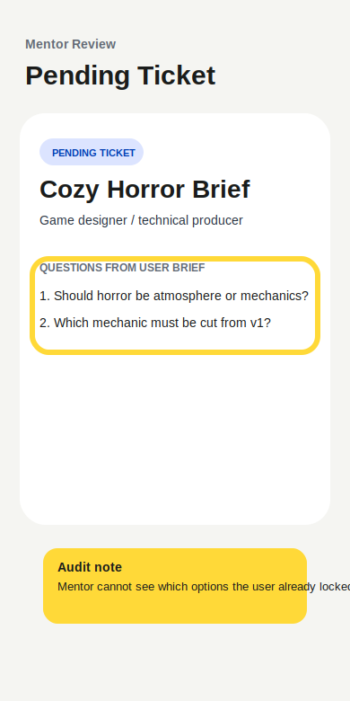

# Audit Report 03 - Mentor Decision Context

**Screen:** `mentor.ticketDetail`  
**Reporter:** customer-developer  
**Type:** feature repair input  
**Widget state:** burn-in highlight over mentor ticket questions

## Customer Note

The mentor sees why review is needed and the questions, but not what the user
already selected in Game Decisions. Mentor feedback should be based on those
locked choices, otherwise the future plan may contradict the user.

## Forge Input

- READ: inspect mentor queue and ticket detail rendering.
- LOCATE: ticket summary and `renderMentorTicketDetail`.
- HYPOTHESIZE: if mentor sees locked user decisions, feedback writeback becomes
  a better closed loop.
- REPAIR: show locked decision count in the ticket list and selected decisions
  inside ticket detail.
- TEST: `npm run typecheck` plus create brief -> save ticket -> mentor review.
- VERIFY: mentor ticket contains user decision context before feedback input.
