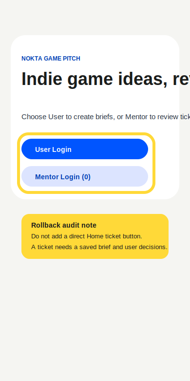

# Audit Report 04 - Rollback Direct Home Ticket

**Screen:** `home`  
**Reporter:** customer-developer  
**Type:** rollback input  
**Widget state:** burn-in highlight over role entry actions

## Customer Note

It would be faster if Home had a button to create a mentor ticket directly from
scratch.

## Forge Input

- READ: inspect home role entry and ticket creation lifecycle.
- LOCATE: `saveCurrentBrief`, `ReviewTicket`, and mentor queue assumptions.
- HYPOTHESIZE: adding a direct ticket button may reduce steps.
- REPAIR ATTEMPT: rejected before code is retained.
- TEST: lifecycle check against data model.
- VERIFY: rollback, because a mentor ticket requires a saved brief, readiness,
  mentor packet, and selected user decisions. A context-free ticket would break
  the customer-developer loop.
